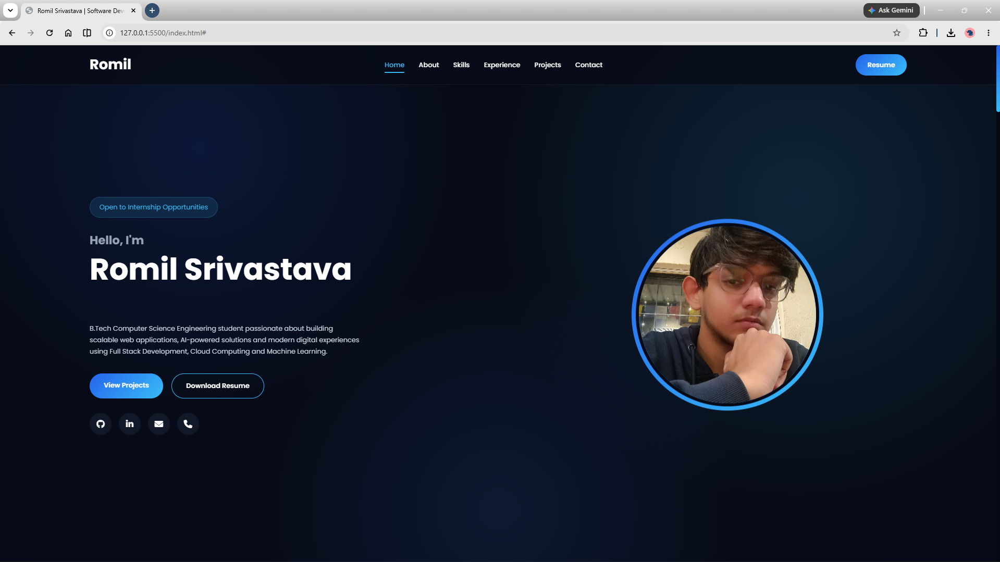

# Romil Srivastava Portfolio



A modern, responsive, and interactive personal portfolio website showcasing my skills, projects, experience, and achievements as a Computer Science Engineering student and aspiring Software Developer.

## 🚀 Features

- Modern Glassmorphism UI
- Fully Responsive Design
- Smooth Scrolling Navigation
- Animated Typing Effect
- Scroll Reveal Animations
- Interactive Project Showcase
- Experience Timeline
- Skills Section
- Contact Form
- Resume Download
- Mobile-Friendly Layout

## 🛠️ Technologies Used

- HTML5
- CSS3
- JavaScript
- Font Awesome
- Google Fonts

## 📂 Project Structure

```text
Portfolio/
│── index.html
│── style.css
│── script.js
│── README.md
│
├── images/
│   ├── profile.jpg
│   ├── project1.png
│   ├── project2.png
│   ├── project3.png
│   ├── portfolio-preview.png
│   └── RomilSrivastava_Resume.pdf
```

## 📸 Featured Projects

- AI-Powered Dynamic Pricing Engine
- Smart Campus Management System
- Serverless Notes App

## 📄 Resume

Download my resume directly from the portfolio website.

## 📬 Contact

**Name:** Romil Srivastava

**Email:** romilfzd@gmail.com

**Phone:** +91 1234567890

**Location:** Ayodhya, Uttar Pradesh, India

## 🌐 Connect With Me

- GitHub: https://github.com/R-M-executives
- LinkedIn: https://www.linkedin.com/in/romil-srivastava-316261296

---

⭐ If you like this project, consider giving it a star on GitHub!
